# DevTree — Architecture Deep Dive

This document explains the design decisions, algorithms, and patterns used throughout the DevTree codebase. It is intended as a learning resource — every section explains not just *what* the code does but *why* it was designed that way, and what you might do differently in production.

---

## Table of Contents

1. [System Overview](#1-system-overview)
2. [Component Hierarchy](#2-component-hierarchy)
3. [Data Model](#3-data-model)
4. [State Management](#4-state-management)
5. [Block Editor](#5-block-editor)
6. [Tree Data Structure](#6-tree-data-structure)
7. [Drag and Drop](#7-drag-and-drop)
8. [Internationalisation (i18n)](#8-internationalisation-i18n)
9. [Theming](#9-theming)
10. [Testing Strategy](#10-testing-strategy)
11. [Deployment (Docker)](#11-deployment-docker)

---

## 1. System Overview

DevTree is a **client-rendered single-page application** built on Next.js. The heavy lifting (block editor, file tree, drag-and-drop) all happens in the browser — the server only handles authentication (NextAuth) and database access (Prisma).

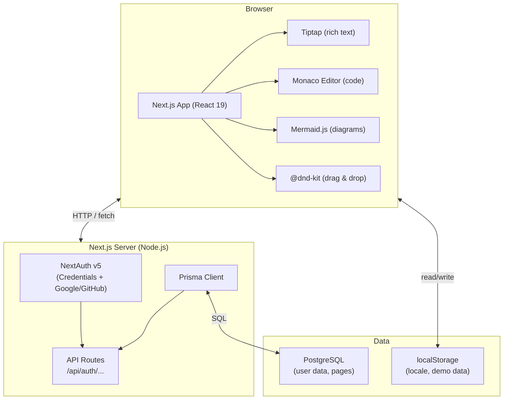

**Key architecture decision: client-side state**

All page/block state lives in React's `useState` (in `Workspace.tsx`) rather than a database. This means:
- ✅ Zero latency for edits — no server round-trips
- ✅ Works offline
- ❌ Data is lost on page refresh (no persistence in demo mode)
- ❌ No real-time collaboration

*Production improvement:* Add auto-save (debounced API call on every block change) or use a CRDT library like Yjs for real-time collaboration.

---

## 2. Component Hierarchy

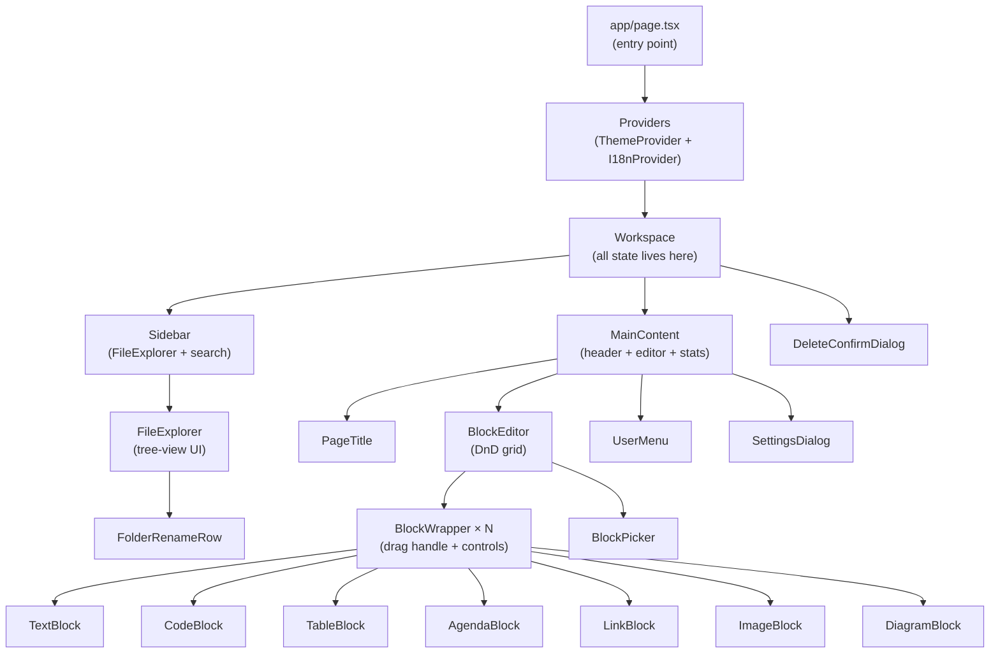

**Why is all state in `Workspace`?**

This is the "lifting state up" pattern. The sidebar needs to know which page is active (to highlight it in the tree). `MainContent` needs the active page's blocks. Rather than duplicating state or using global state, both components receive what they need as props from their common ancestor (`Workspace`).

*Alternative:* A global state manager (Zustand, Redux) would make sense once the component tree gets deeper than 3-4 levels or when sibling components at the same level need to share state without a common parent.

---

## 3. Data Model

### Page and Block

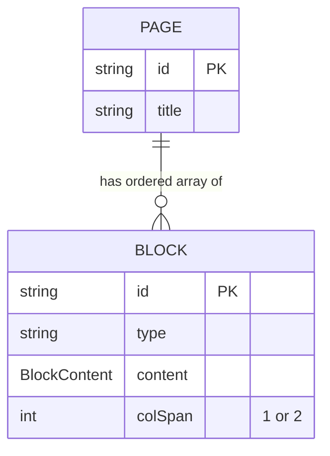

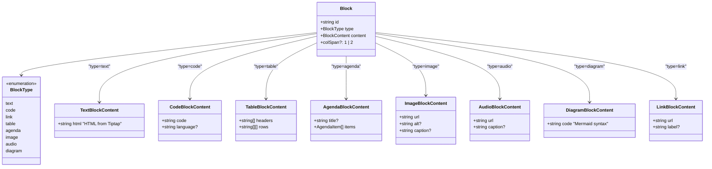

**Why a discriminated union for `BlockContent`?**

Each block type has a completely different shape. A discriminated union (`type TextBlockContent = string | CodeBlockContent | ...`) allows TypeScript to narrow the type based on runtime checks:

```typescript
if (type === 'code' && isCodeBlockContent(content, type)) {
  // TypeScript knows content is CodeBlockContent here
  return <CodeBlock content={content} onChange={onChange} />;
}
```

Without this, every component would need `as` casts, losing type safety.

### Tree Model

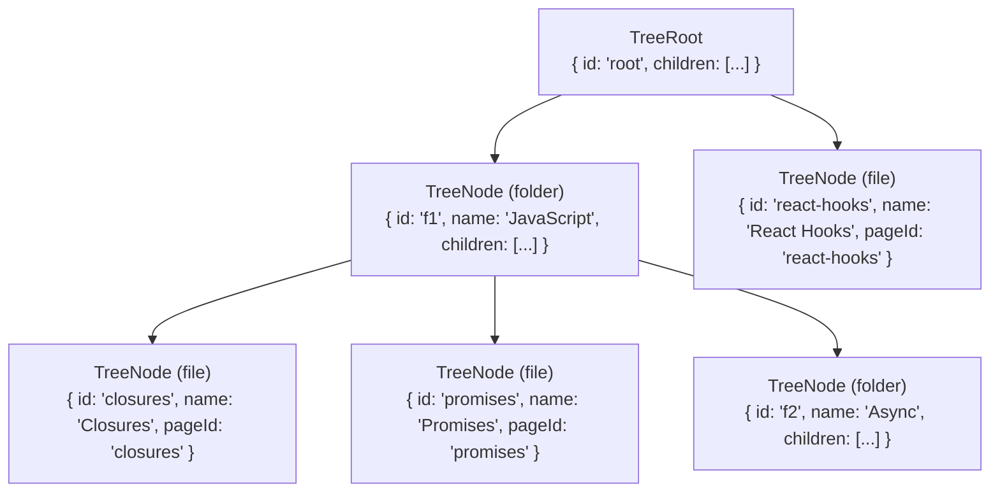

**Two separate data structures — why?**

| Structure | Stores | Used for |
|-----------|--------|----------|
| `TreeRoot` | Hierarchy + pageId references | Sidebar navigation |
| `Page[]` | Titles + block content | Editor |

The tree stores *where* pages live (folder hierarchy). The pages array stores *what* pages contain (blocks). This separation mirrors a real file system: the directory listing stores paths, not file contents.

---

## 4. State Management

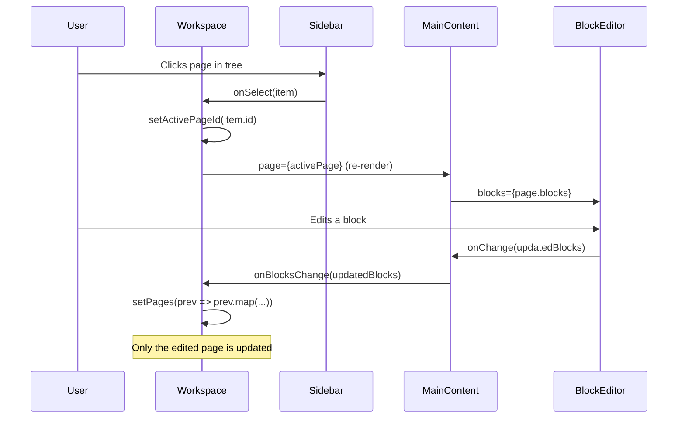

**Immutability pattern**

Every state update creates a new array/object instead of mutating in place:

```typescript
// ✅ Correct — creates a new page array
setPages(prev => prev.map(p =>
  p.id === activePageId ? { ...p, blocks } : p
));

// ❌ Wrong — mutates React state directly
pages.find(p => p.id === activePageId).blocks = blocks; // never do this
```

Why? React detects changes by comparing references (`Object.is`). If you mutate an object, the reference stays the same, React sees "no change", and the component doesn't re-render.

**`useCallback` and `useMemo` usage**

- `useCallback` wraps event handlers that are passed to child components. Without it, a new function reference is created on every parent render, causing children to re-render even when nothing changed.
- `useMemo` wraps derived values (like `treeData`, `activePage`, `searchResults`) that are expensive to recompute.

---

## 5. Block Editor

### Column Layout Algorithm

The block grid uses CSS `grid-cols-2`. Each block can be `colSpan: 1` (half-width) or `colSpan: 2` (full-width). The `computeColumnMap` function determines which visual column (left=0, right=1) each half-width block occupies — this is needed so editing controls appear on the *outer* edge of the block, not between adjacent blocks.

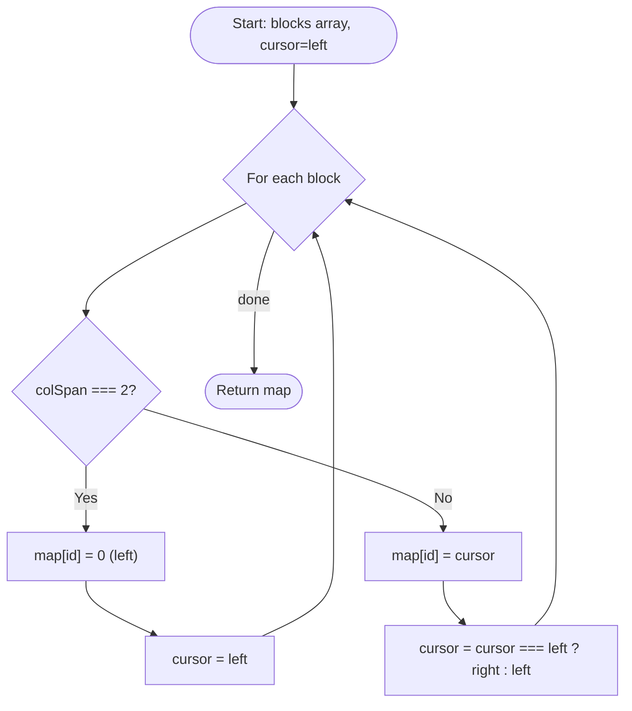

Example for `[half, half, full, half, half]`:
```
Block 0 (half): column 0 (left),  cursor → right
Block 1 (half): column 1 (right), cursor → left
Block 2 (full): column 0 (left),  cursor reset → left
Block 3 (half): column 0 (left),  cursor → right
Block 4 (half): column 1 (right), cursor → left
```

Visual result:
```
┌─────────────┬─────────────┐
│  Block 0    │  Block 1    │
├─────────────┴─────────────┤
│         Block 2           │
├─────────────┬─────────────┤
│  Block 3    │  Block 4    │
└─────────────┴─────────────┘
```

### Block Type Guard Pattern

```typescript
// In BlockEditor's BlockContent render function:
if (type === 'code' && isCodeBlockContent(content, type)) {
  return <CodeBlock content={content} onChange={onChange} />;
}
```

The double check (`type === 'code'` AND `isCodeBlockContent`) is intentional:
1. `type` is the canonical discriminant — authoritative, fast.
2. `isCodeBlockContent` checks the runtime shape — catches corrupted data.
3. TypeScript uses both to narrow `content` to `CodeBlockContent`.

---

## 6. Tree Data Structure

### Immutable Updates (Path Copying)

When a node deep in the tree is modified, we create new objects only along the *path* from the root to that node. Other branches keep their original references (structural sharing).

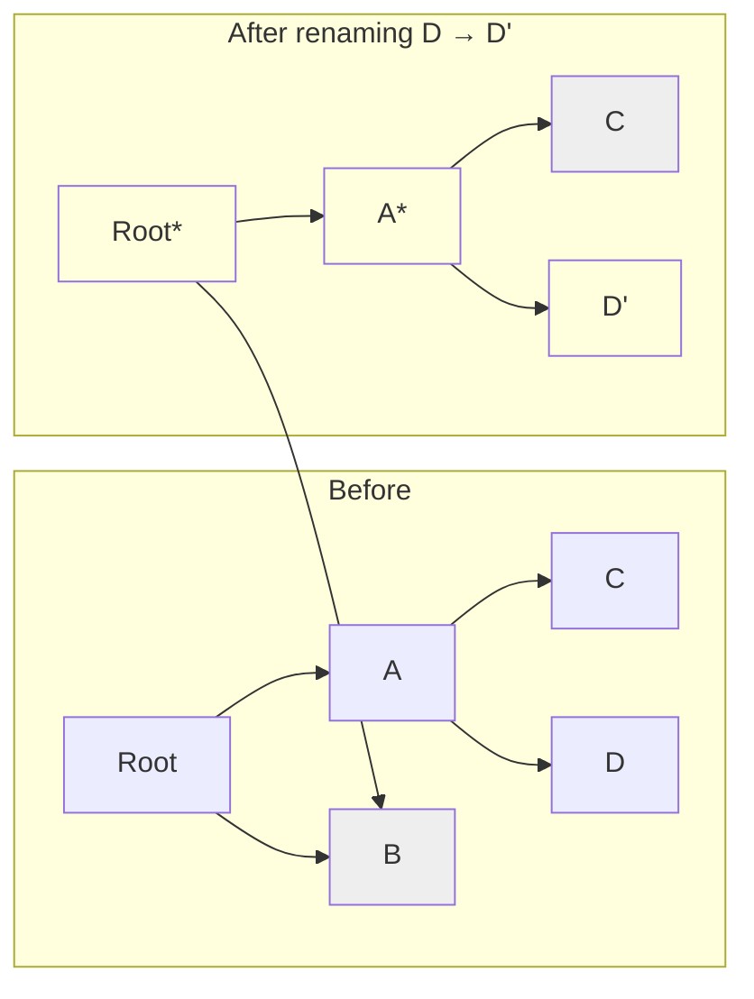

`*` = new object. `C` and `B` are **shared** — no copies made.

### Cycle Detection in `moveNode`

When a user drags a folder into one of its own descendants, `moveNode` must detect and reject the operation to prevent a circular tree.

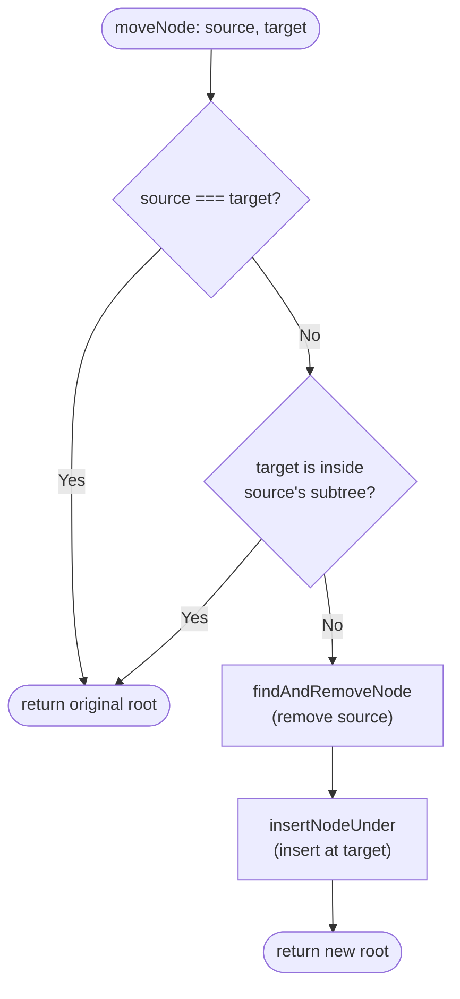

`wouldCreateCycle` collects all ids in the source's subtree and checks if `targetId` is among them — O(n) where n = subtree size.

---

## 7. Drag and Drop

DevTree uses [@dnd-kit](https://dndkit.com) for two separate drag-and-drop systems:

### Block reordering (BlockEditor)

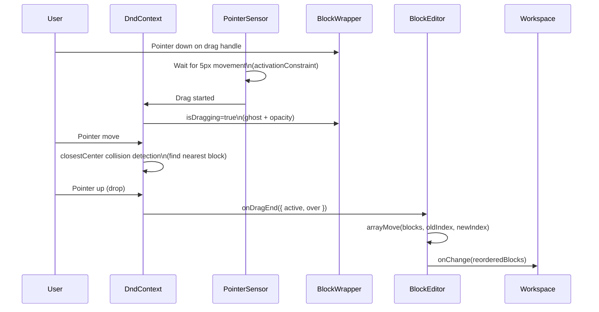

**Why `activationConstraint: { distance: 5 }`?**

Without it, any mousedown on a draggable starts a drag. This makes clicking buttons *inside* blocks impossible (they'd start a drag instead). The 5px threshold means the user must intentionally move the pointer before the drag begins.

**Why `restrictToVerticalAxis` modifier?**

Blocks should only reorder vertically (up/down). Without this modifier, dragging creates horizontal ghost movement which looks wrong in a vertically-scrolling list.

### File tree reordering (FileExplorer)

The tree drag-and-drop is handled separately in the `tree-view` UI component. When a tree item is dropped, `handleDocumentDrag` in `Workspace` calls `moveNode` from `treeUtils.ts`.

Special case: dropping onto a *file* node redirects the drop to the file's *parent* folder (so you can't nest folders inside pages).

---

## 8. Internationalisation (i18n)

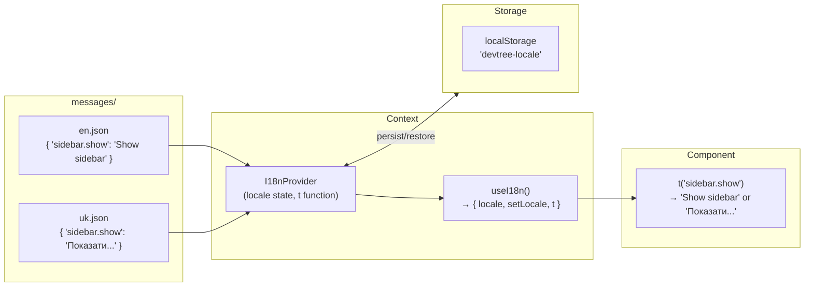

**Template substitution:**

```
"delete.folderDescription": "\"{{name}}\" contains {{count}} item(s)."

t('delete.folderDescription', { name: 'Notes', count: 5 })
→ '"Notes" contains 5 item(s).'
```

The regex `\\{\\{${k}\\}\\}` with flag `g` replaces all occurrences of `{{key}}` in the template string. The double-brace syntax is borrowed from Handlebars/Mustache, which users are likely familiar with.

**Hydration safety:**

The server always renders in English (`useState('en')`). After hydration, a `useEffect` reads localStorage and updates the locale. This prevents a React hydration mismatch (server HTML ≠ client HTML).

---

## 9. Theming

DevTree uses [`next-themes`](https://github.com/pacocoursey/next-themes) with the CSS class strategy:

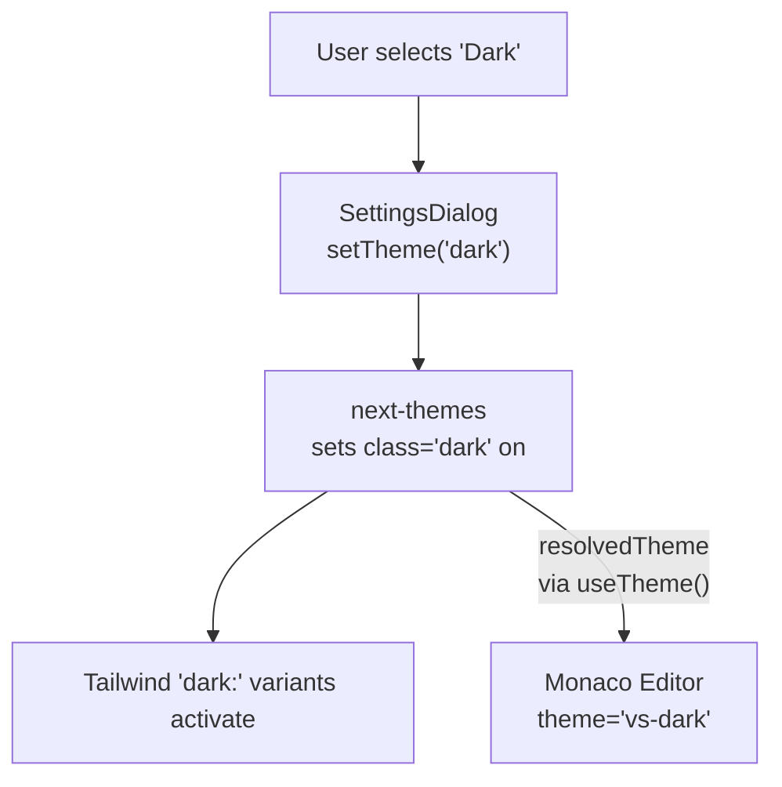

Tailwind's `dark:` utility classes (e.g. `dark:bg-zinc-900`) are compiled to:

```css
.dark .bg-zinc-900 { /* applied */ }
```

When `next-themes` adds `class="dark"` to `<html>`, all `dark:` classes activate instantly — no JavaScript needed at runtime.

**Monaco theme sync:**

Monaco has its own internal theme (`vs` / `vs-dark`). We use `useTheme().resolvedTheme` to read the actual current theme (resolving 'system' to the OS preference) and pass it to `<MonacoEditor theme={editorTheme}>`.

---

## 10. Testing Strategy

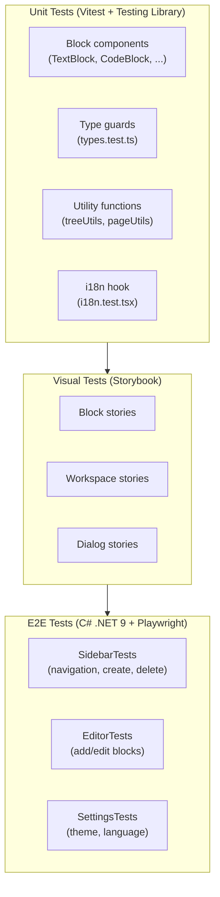

### Testing pyramid rationale

| Layer | Count | Speed | Confidence | Cost |
|-------|-------|-------|-----------|------|
| Unit tests | ~134 | ~3s | Component logic | Low |
| Storybook stories | ~20 | Manual | Visual appearance | Low |
| E2E tests | ~32 | ~60s | Full user journeys | High |

**Unit test philosophy:**

- Test behaviour, not implementation. `screen.getByRole('button', { name: /save/i })` is more resilient than `container.querySelector('.save-btn')`.
- Use `fireEvent.change` for controlled inputs (vs `userEvent.type`) — controlled React inputs don't re-render with `userEvent.type` in isolation.
- Wrap components using `useI18n` in `<I18nProvider>`.
- Mock external dependencies (Monaco Editor, Mermaid, next-themes) via `vi.mock()`.

**E2E test philosophy (Page Object Model):**

```
AppPage
  ├── SidebarPage   — all sidebar interactions
  ├── EditorPage    — all block editing interactions
  └── SettingsPage  — all settings dialog interactions
```

Each Page Object wraps locators and actions so tests read like English:

```csharp
await App.Sidebar.CreatePageAsync();
await App.Editor.AddBlockAsync("code");
await App.Editor.SetCodeLanguageAsync("typescript");
```

---

## 11. Deployment (Docker)

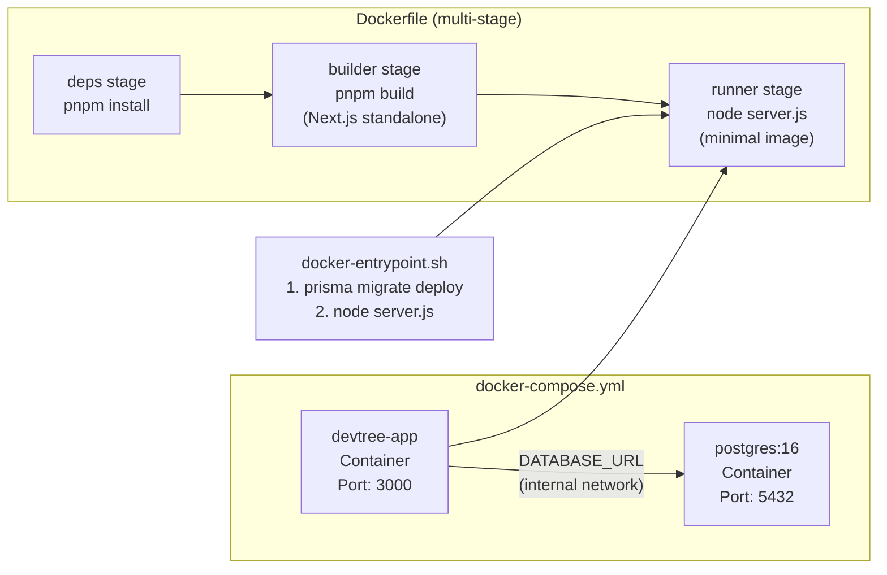

**Multi-stage Docker build:**

1. **deps** — installs all dependencies. Cached unless `package.json` changes.
2. **builder** — runs `next build` producing `.next/standalone` — a self-contained Node server with only production dependencies.
3. **runner** — copies only the standalone output (~50 MB) into a minimal Alpine image. Excludes `node_modules`, source files, tests, stories.

**Why `output: 'standalone'`?**

Next.js normally requires the full `node_modules` (~500 MB) at runtime. `standalone` mode traces which files are actually used and bundles only those, producing a production image that is 80-90% smaller.

---

## Further Reading

| Topic | Link |
|-------|------|
| Next.js App Router | https://nextjs.org/docs/app |
| React — thinking in React | https://react.dev/learn/thinking-in-react |
| ProseMirror (Tiptap's engine) | https://prosemirror.net/docs/guide/ |
| @dnd-kit concepts | https://docs.dndkit.com/introduction/concepts |
| Tailwind CSS | https://tailwindcss.com/docs |
| Mermaid.js syntax | https://mermaid.js.org/syntax/flowchart.html |
| Prisma ORM | https://www.prisma.io/docs |
| Vitest | https://vitest.dev/guide/ |
| Playwright (.NET) | https://playwright.dev/dotnet/docs/intro |
